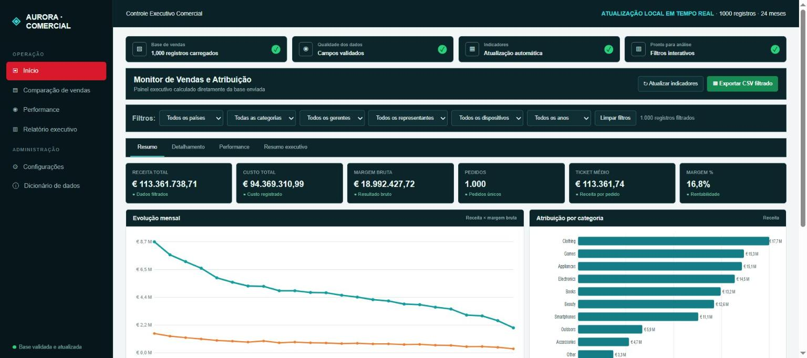

# Análise de Vendas Online — Controle Executivo Comercial

> Dashboard interativo que transforma uma base de 1.000 pedidos em indicadores de receita, custo e margem por país, categoria, gerente, representante e dispositivo.




## Acesse

| | |
|---|---|
| **Dashboard ao vivo** | [luiscarlossoarespro-cyber.github.io/analise-vendas-online](https://luiscarlossoarespro-cyber.github.io/analise-vendas-online/) |
| **Base de dados** | [Base_Analitica_Vendas_Atualizada (2).csv](Base_Analitica_Vendas_Atualizada%20(2).csv) |

---

## 1. Problema de negócio

Uma operação de vendas com vários países, categorias e equipes gera muitos registros, mas pouca clareza. A gestão precisa ver rapidamente **quanto vendeu, quanto lucrou e quem ou o que puxa o resultado**.

## 2. Perguntas que o projeto responde

- Qual é a receita, o custo, a margem bruta e o ticket médio do período?
- Como a receita e a margem evoluíram mês a mês?
- Quais **categorias** e **países** concentram a receita?
- Quais **gerentes** e **representantes** têm melhor desempenho?
- Há diferença de resultado por **dispositivo** (PC, mobile, tablet)?

## 3. Dados

- **Base:** 1.000 pedidos de uma loja online, 24 meses (2019–2020), 15 países e 10 categorias.
- **Campos:** pedido, data, país, categoria, gerente, representante, dispositivo, receita e custo.
- **Tratamento:** organização e validação da base no Excel antes da carga no dashboard.

## 4. Ferramentas

| Camada | Ferramenta |
|---|---|
| Preparação dos dados | Excel |
| Visualização | HTML, CSS e JavaScript |
| Publicação | GitHub e GitHub Pages |

## 5. Solução

- **Indicadores:** receita total, custo total, margem bruta, pedidos, ticket médio e margem %.
- **Gráficos:** evolução mensal (receita × margem), atribuição por categoria, performance por país, ranking de gerentes e de representantes, análise por dispositivo.
- **Filtros combinados:** país, categoria, gerente, representante, dispositivo e ano.
- **Abas:** Resumo, Detalhamento dos pedidos, Performance e Resumo executivo, com exportação do CSV filtrado.

## 6. Principais resultados (base completa)

- Receita de **€ 113,4 milhões** com margem bruta de **16,8%** em 1.000 pedidos.
- **Clothing** é a categoria que mais fatura (€ 17,7 M), seguida de Games e Appliances.
- **Portugal** (€ 27,8 M) e **França** (€ 25,9 M) concentram quase metade da receita.
- A receita é **concentrada em poucos gerentes**: os 3 primeiros somam mais de 60% do total.

## 7. Como usar

Abra o dashboard ao vivo e combine os filtros do topo. Os indicadores e gráficos se recalculam na hora. Use **Exportar CSV filtrado** para levar o recorte para o Excel.

## 8. Estrutura do repositório

```
analise-vendas-online/
├── index.html                                  # dashboard (HTML, CSS e JavaScript)
├── Base_Analitica_Vendas_Atualizada (2).csv    # base de pedidos
├── assets/cover.png                            # imagem de capa
└── README.md
```

## 9. Aprendizados e próximos passos

- **Aprendi:** estruturar KPIs comerciais, cruzar dimensões com filtros combinados e publicar um projeto na web.
- **Próximos passos:** análise de sazonalidade, curva ABC de produtos e versão em Power BI.

---

## Autor

**Luis Carlos Machado Soares** · 19 anos em logística e operações, em transição para Análise de Dados
[LinkedIn](https://www.linkedin.com/in/luiscarlos-log) · [Portfólio](https://luiscarlossoarespro-cyber.github.io/)
